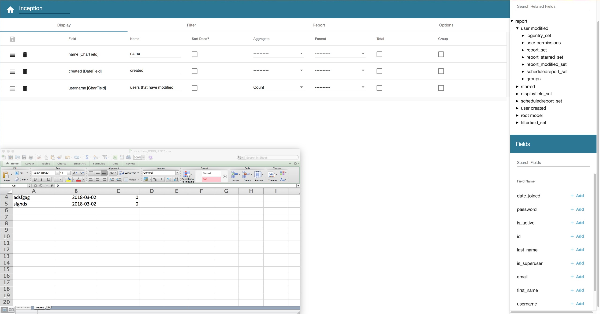

# django-report-builder

A GUI for Django ORM. Build custom queries and display results.
Targets sys admins and capable end users who might not be able to program or gain direct interactive shell access.

Please consider supporting the project via librepay. Paid commercial support is also available. Email info@burkesoftware.com for more infomation.

# News

## 6.3

- Added Django 2.2 support. Django 1.11 and 2.1 are still supported.
- Unit tests finally run in Python 3.7 thanks to Celery supporting it
- Angular updated to version 7

## 6.2

- Added partial Python 3.7 support. We can't fully support Python 3.7 until Celery does.

## 6.1

- Added Django 2.1 support. 2.0 and 1.11 are still supported.

# What is Django Report Builder?

## Features

* Add filters
* Add display fields
* Preview and create xlsx reports
* Very simple security, user must have change or "view" permission to view
  reports. Unprivileged users can still build reports and see database schema.
* Model properties (thanks yekibud)
* Export to Report global admin action
* Scheduled reports can generate and send to users on cron like schedule
* Optional asynchronous report generation

# Documentation

http://django-report-builder.readthedocs.org/

[Google group](https://groups.google.com/forum/#!forum/django-report-builder/).

[Contributing](http://django-report-builder.readthedocs.org/en/latest/contributors/)

## Development quick start

This package uses Django in Docker and Angular CLI for development purposes.

1. Start docker `docker-compose up`
2. Migrate and  create an admin user `docker-compose run --rm web ./manage.py migrate`
3. Start the Angular CLI server. Ensure Node is installed. `cd js`, `yarn`, `yarn start`
4. Django runs on port 8000 by default. Go to localhost:8000/admin and log in.
5. Angular runs on port 4200. Now that you are logged in, go to localhost:4200

More detailed instructions are at [here](https://django-report-builder.readthedocs.io/en/latest/contributors/)
